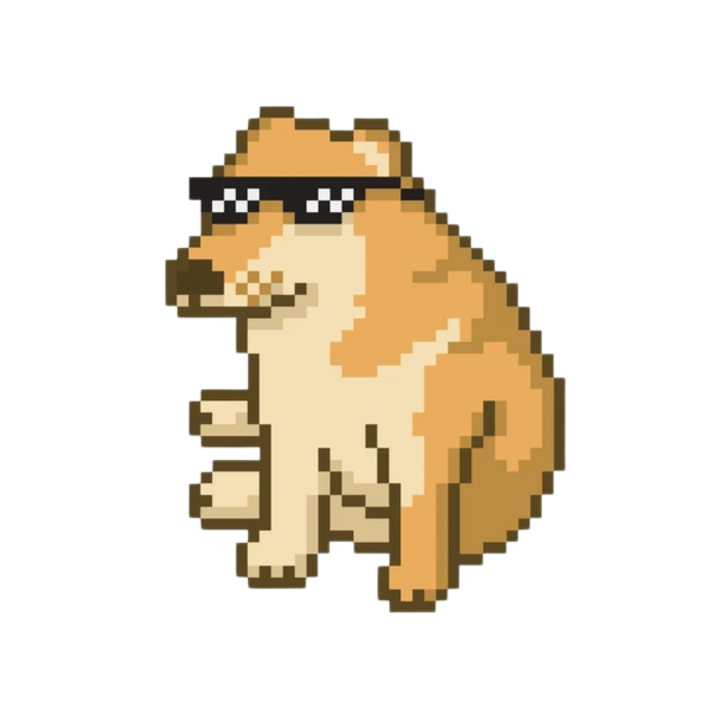
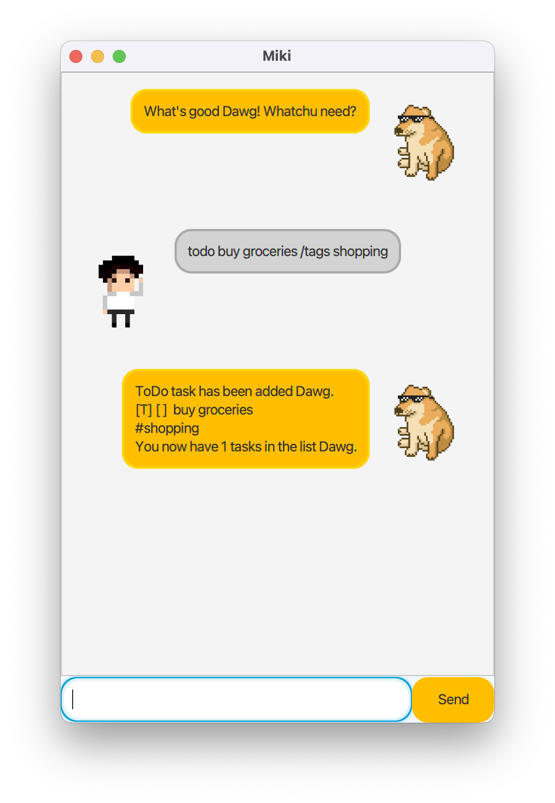
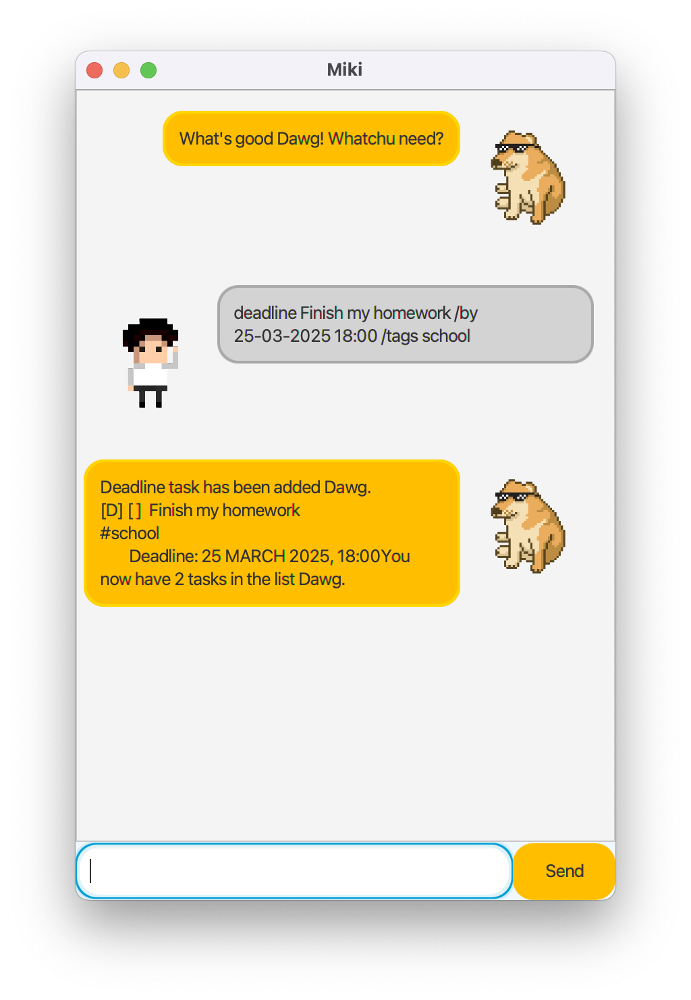
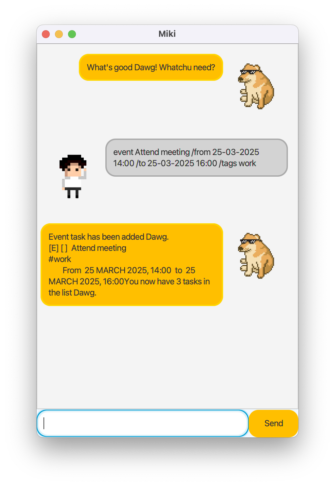
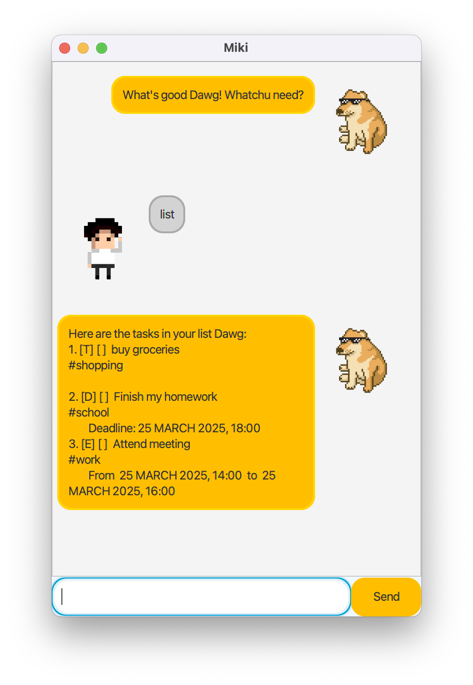
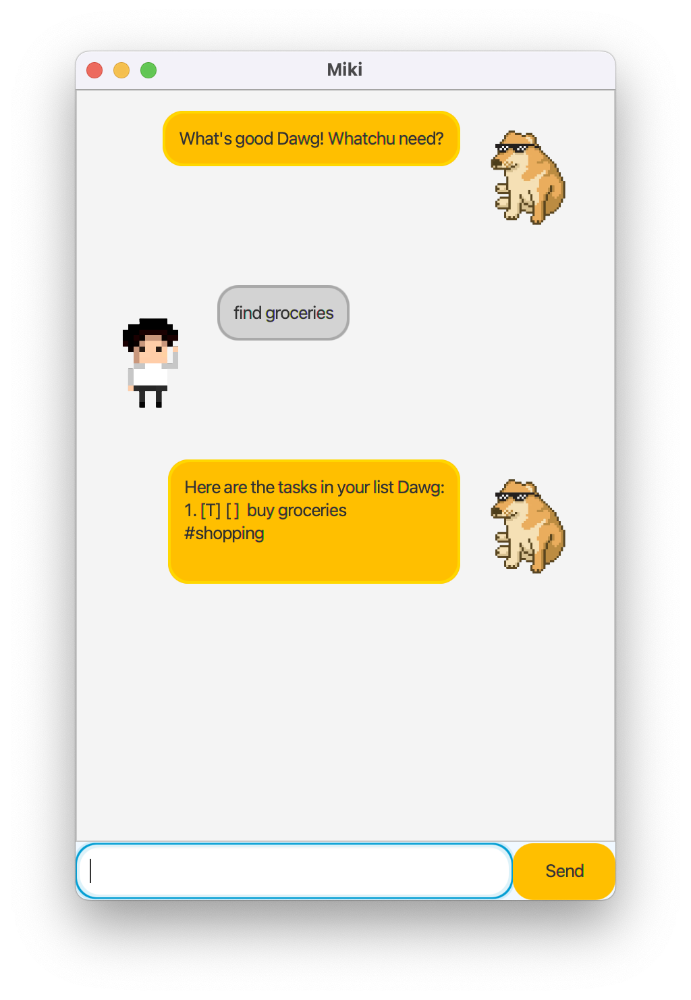
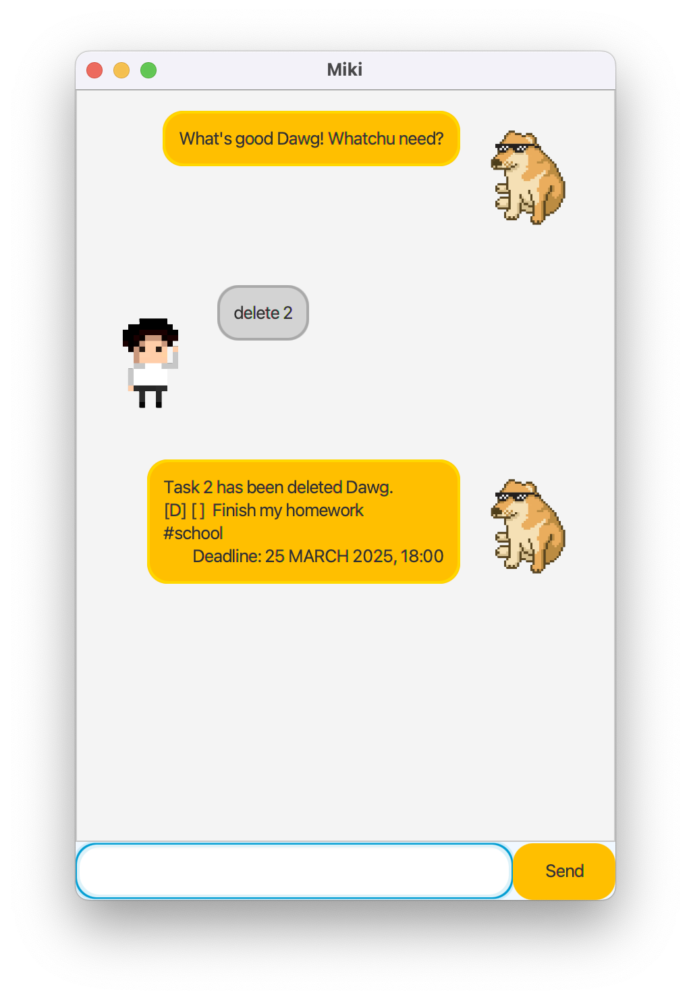
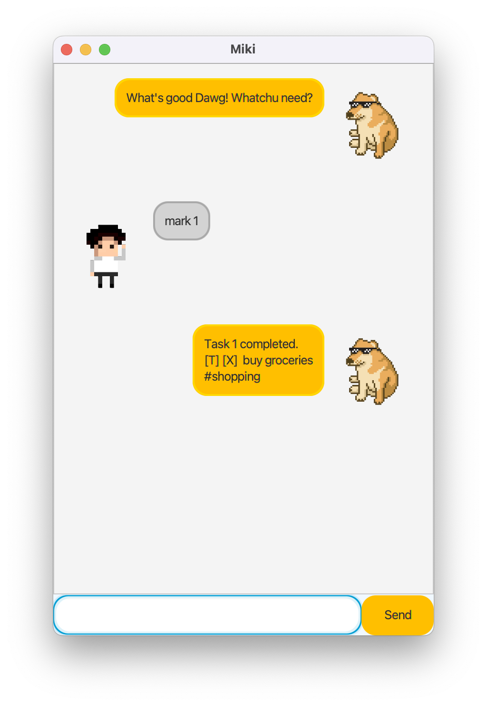
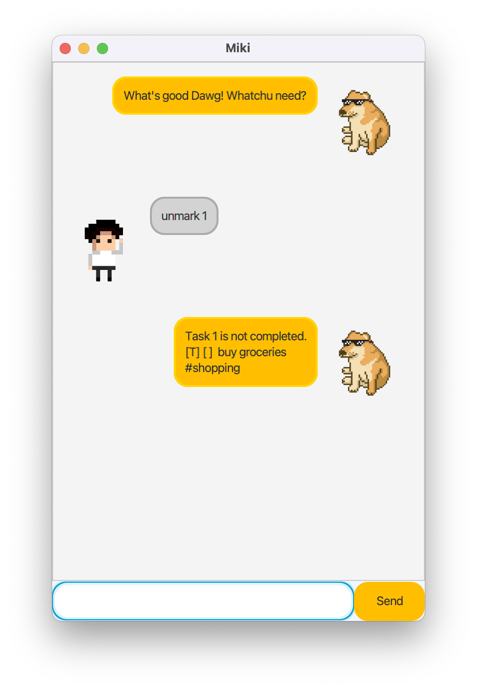
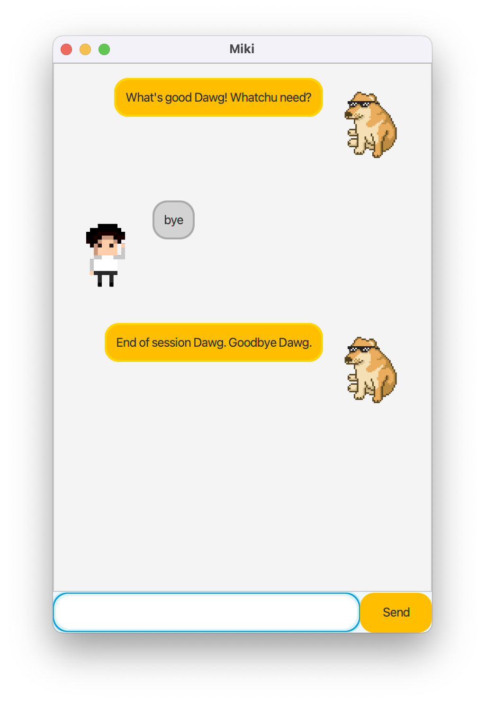

# MIKI User Guide

_Your DAWG Chatbot_

Get yourself a real dawg that helps you settle all your tasks and what not.

- GUI-based
- Easy to learn
- No fuss

All you need to do is,

1. Download.
2. Open.
3. Say your tasks.
4. Let MIKI do the job for you.
   Settle Kettle bro.

Everyone loves MIKI. 🐕

## Adding todos

Add a todo task to let Miki keep track of your tasks. Dawg's got your back.

Format: `todo {description} /tags {tags}`

Example: `todo Buy groceries /tags shopping`

Adds a todo task with the given description and any additional tags provided.

## Adding deadlines

Add a deadline task to let Miki remind you that you have a deadline to complete. Dawg won't let you down.

Format: `deadline {description} /by {deadline date} /tags {tags}`

Example: `deadline Finish my homework /by 25-03-2025 18:00 /tags school`

Adds a deadline task with the given description and deadline, as well as any additional tags provided.

## Adding events

Add an event task to let Miki remind you of your events. Dawg won't let you miss it.

Format: `event {description} /from {start date} /to {end date} /tags {tags}`

Example: `event Attend meeting /from 25-03-2025 14:00 /to 25-03-2025 16:00 /tags work`

Adds an event task with the given description and event date, as well as any additional tags provided.

## Listing tasks

List all the tasks that Miki is currently keeping track of. Dawg's got everything under control.

Format: `list`

Displays all the tasks in the order they were added.

## Finding tasks

Find tasks that match a given keyword. Dawg will find it for you.

Format: `find {keyword}`

Example: `find groceries`

Displays all tasks that contain the given keyword in their description.

## Deleting tasks

Delete a task that Miki is keeping track of. Dawg will let it go.

Format: `delete {task number}`

Example: `delete 2`

Deletes the task with the given task number.

## Marking tasks as done

Mark a task as done to let Miki know you've completed it. Dawg will be proud.

Format: `mark {task number}`

Example: `mark 1`

Marks the task with the given task number as done.

## Unmarking tasks

Unmark a task to let Miki know it's not done yet. Dawg will understand.

Format: `unmark {task number}`

Example: `unmark 1`

Unmarks the task with the given task number.

## Exit the chatbot

Say goodbye to Miki and close the chatbot. Dawg will be sad but he understands.

Format: `bye`

Closes the chatbot.

## Saved tasks between sessions

Your tasks are automatically saved between sessions, so you don't have to worry about losing your data. Dawg's got you covered.

Whenever you start MIKI, it will load all your previously saved tasks, ensuring you can pick up right where you left off.
